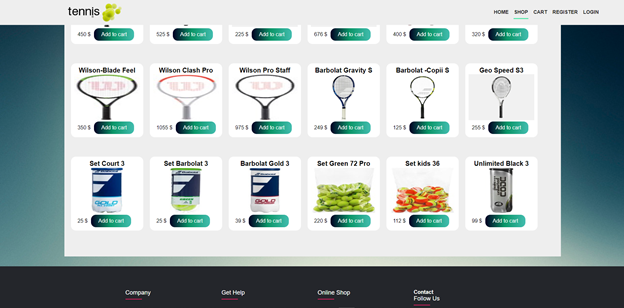
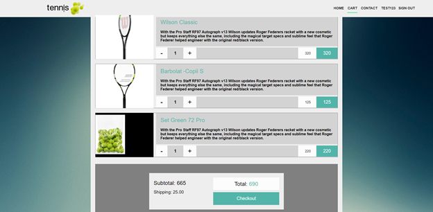
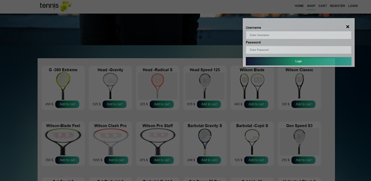
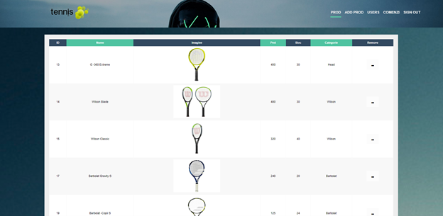

# Web_Sop_Tennis
Online shop with tennis accessories
Nancu Petrica

 

Simple site designed for selling articles and accessories for "court tennis";
Access to all pages will be done using the navigation bar at the top of the site.

 

 

The database used is phpmyadmin.

The first page that will open is !!!!!!!!!!"home_default.php"!!!!!! Here are the products from the store, displayed by category, the page is intended for the guest user who can check the items for sale without the permission to add items or edit the cart. Any attempt to add a product or access the cart without being logged in will redirect you to the login page.

On the first page there is a button in the navigation bar for fast login directly through a pop-up or register that redirects us to another page.
If the login is accessed from the home page and the credentials are not correct, the user is shown an error on the special login page where he can switch to account registration.

 

In the register page the unique field (username), that returns an error in the case of duplicates, will be checked, as well as the confirmation of the password to be identical. After registration, a table called "cart_username" will be created in the database for each username, where the data about the shopping cart will be saved.

All pages are scalable for different devices and the products displayed on the page have a fixed size so that they are not too small when using the phone.

The site can also be logged in with administrator rights username: Admin pass: admin, here will be displayed data about the current products on the site with the possibility to delete products, another page displaying data about users, where the password is not in clearly it is hashed with md5 for confidentiality. You can also add products and view related orders from the administrator page.

 
